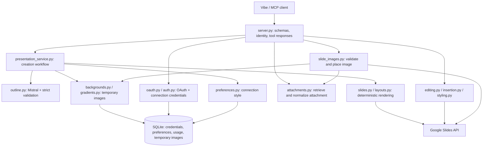

# MCP Slides

A deployed MCP connector for Vibe that creates and edits Google Slides in each
user's own Google Drive. Mistral generates the content and cover image; users
receive a real presentation link they can open and edit.

**Connector URL:** https://mistral-slides-mcp-production.up.railway.app/mcp

## Try it

1. Add the URL as a custom MCP connector in Vibe, without a shared Authorization header.
2. Connect, review the MCP Slides consent page, and choose an approved Google account.
3. Ask: “Make me three slides about AI agents for sales teams.”
4. Open the returned link, then ask for a text revision, another slide, or a style change.

The pilot admits the configured company domain and invited personal accounts.
See the [user guide](docs/user-guide.md) for access details and example prompts.

## What it does

Nine tools cover presentation generation, reading, text revision, slide insertion,
attachment placement, deck styling, and reading/saving/resetting style defaults. Content supports key
messages, bullets, comparisons, and steps, with a generated cover image.

Editing is deliberately bounded: it preserves the existing deck and supported
structure. It is not a general-purpose slide editor. Exact contracts and limits
are in [capabilities](docs/capabilities.md).

## Repository

```text
src/mcp_slides/         Maintained application
tests/                Automated tests
scripts/investigation/ Historical runnable experiments and legacy server
docs/                 User guide, auth, capabilities, assignment and checklist
docs/history/         Investigation and implementation history
```

## Architecture and end-to-end flow



For “Make me three slides about AI agents,” the MCP layer validates the brief and
loads the authenticated connection's credentials before spending any model quota.
The presentation service loads saved styling, requests exactly three structured
content slides, and validates types, lengths and counts. Invalid model output gets
one additional attempt. It then generates and temporarily publishes a cover image.
The renderer builds the Google requests before creating a deck, then populates it
in one batch, removing any starter slides in that batch. The result contains the
exact Google URL, three content slides **plus one cover**, and applied styling.
Temporary images are cleaned up afterwards, with expiry as a backstop.

Read the code in that order. `layouts.py` contains geometry; `slides.py` turns
validated content into API requests; `presentation_service.py` owns creation
sequencing and safe errors. Existing-deck operations have their own service
functions and require a current Google revision before writing. Auth and storage
remain together in `auth.py` for this small pilot; there is no repository layer
or dependency-injection framework.

## MCP interface and design choices

| User intent | Tool(s) |
| --- | --- |
| Create a new deck | `generate_presentation` |
| Inspect current text, IDs and revision | `get_presentation` |
| Revise one slide's supported text | `edit_slide` |
| Insert one content slide | `add_slide` |
| Add or replace an attachment on an existing slide | `set_slide_image` |
| Change this deck's appearance | `set_presentation_style` |
| Inspect, save or reset future defaults | `get_default_style`, `set_default_style`, `reset_default_style` |

Nine tools are a deliberate breadth tradeoff: six deck operations and three
preference operations. None exposes rendering primitives, model calls or Google
batch requests. Existing names are preserved for connected clients. A smaller
future interface could consolidate preference management, but would need a clear
migration. Tool descriptions specify prerequisites, supported structures, side
effects and retry behavior; creation and insertion are explicitly non-idempotent.

Fixed layouts and strict text budgets make generation predictable and editing
bounded. A generated cover remains required: image failure stops before deck
creation, rather than silently changing the requested output. Google credentials
are used per connection; no shared Drive identity is used.

Investigation tools are preserved for learning and reproducibility, outside the
installed package. They are not used by Railway. See their
[README](scripts/investigation/README.md) before running them.

## Local setup

Requires Python 3.12+ and `uv`.

```sh
uv sync --locked
cp .env.example .env
# Fill in .env with your own configuration.
uv run --env-file .env mcp-slides
```

For local OAuth, set `PUBLIC_BASE_URL=http://localhost:8000`,
`TOKEN_DB_PATH=.secrets/tokens.sqlite3`, and `OAUTHLIB_INSECURE_TRANSPORT=1` in your
local environment. Authorize `http://localhost:8000/auth/google/callback` in the
Google web client. Never enable insecure transport on Railway.

Connect an OAuth-capable MCP client to `http://localhost:8000/mcp`. Opening the
Google callback or connection-start URL directly does not initiate a valid flow.

## Deployment and authentication

Railway uses [railway.json](railway.json) and the unchanged command
`uv run mcp-slides`. Keep one worker/replica and the persistent `/data` volume;
set `TOKEN_DB_PATH=/data/tokens.sqlite3`. Configure variables from
[.env.example](.env.example) in Railway—pushing that file does not apply them.
`/health` is the deployment health check; `/` and `/privacy` are public pages.

Google credentials stay on the server. Vibe receives separate connector tokens,
with each connection isolated. Authentication is frozen for the pilot; see
[the auth reference](docs/auth.md) for the complete flow, Google Console setup,
access rules, token lifecycle, storage tradeoffs, and troubleshooting.

## Reliability and failure handling

| Failure | Behavior / recovery |
| --- | --- |
| Invalid tool arguments or missing Google connection | Reject before paid generation. Reconnect when instructed. |
| Malformed model output | Strict schema validation; at most two attempts total. No deck is created on exhaustion. |
| Cover generation / download / publication failure | Stop before creating a deck; return a safe error. Images have format, size and dimension limits. |
| Attachment retrieval or validation failure | Leave the deck unchanged. Re-upload an unavailable attachment; distinguish crowded text from unsupported formatting. |
| Google read fails transiently | At most two SDK retries. No mutation is replayed. |
| Creation response is lost | Report that a deck may exist; check Drive for the requested title before retrying. |
| Population fails after a known deck ID | Return the recovery URL. The deck may be empty or complete; inspect before retrying. |
| Stale revision / uncertain edit | Reject or report uncertainty; reread before another mutation. |
| Temporary image cleanup fails | Preserve the operation's result; log cleanup failure. Expired assets become unavailable and are purged on subsequent database access. |

Mistral outline/edit calls use a 60-second SDK timeout; image generation uses
120 seconds and generated-cover download 30 seconds. Attachment retrieval has a
15-second network deadline. The pinned Google API client uses a
60-second HTTP socket timeout. These are provider/transport bounds, **not a total
end-to-end deadline**. Reads may retry; Google writes and paid SDK calls do not.
A disconnected client or timeout does not prove that Google stopped processing.
There is no automatic deletion of a possibly completed deck and no cross-request
idempotency key yet.

Application diagnostics use stable key/value events with server-generated
`request_id`, stage, outcome, elapsed time and exception class. HTTP responses
include `X-Request-ID`. Creation logs the returned URL's SHA-256 for comparison
without logging the URL. Prompts, model output, credentials, query strings and
raw upstream exceptions are excluded from these events. HTTP-client and MCP
INFO logs that could expose OAuth URLs or private recovery links are suppressed;
Google retry warnings that include private URLs/bodies are also suppressed;
Uvicorn access logs are disabled. Avoid enabling verbose provider logging.

## Security and known limitations

The pilot uses PKCE, per-connection token storage and account admission rules.
Connector tokens are hashed; Google credentials are plaintext in the private
SQLite volume. Protect volume access and backups. Revoking a connection removes
its local credentials, preferences and temporary images; it does not delete decks
or revoke Google consent upstream. Temporary image URLs are short-lived bearer
URLs so Google can fetch them. Source text goes to Mistral; it is not retained as
a generation brief. Attached images are retrieved and normalized by the server,
temporarily stored for Google to fetch, and embedded in the deck. The connector
does not send these attachments to the Mistral API. Removing temporary assets
does not remove images already inserted in Google Slides. See [auth](docs/auth.md) for the complete security boundary.

One process and one persistent volume are required. There is no worker queue,
full-deck visual verification, arbitrary template editing, or guarantee of model
factual accuracy. “Three slides” currently means three content slides plus a
cover. Live provider acceptance and screenshots/demo recording remain release
checks, not claims made by the mocked test suite.

## What I would build next for production

1. Persist creation jobs and idempotency keys so client retries resume or recover
   a result without duplicate decks; add a total job deadline and reconciliation.
2. Add an explicit plain-cover fallback policy for image outages, with a visible
   warning and tests, if the product accepts that change.
3. Encrypt Google credentials with managed keys; add backup/restore exercises and
   shared storage before scaling beyond one instance.
4. Track provider latency, failure rates and spend per operation; add a repeatable
   live canary and visual regression examples for the supported layouts.

## Image attachments

Image attachments can be added after generation with `set_slide_image` on short
key-message/bullet slides. Text stays left; the complete image fits on the right.
Explicit replacement reuses the same slot. Wording, font, colors and other slides
are preserved, including font size: automatic shrinking is not implemented.
Each slide has one slot; attachments at creation, cropping and removal are outside
this version. `attachments.py` retrieves and normalizes the fresh attachment;
`slide_images.py` validates layout and applies the revision-protected batch.
Neither imports investigation code. Downloads accept one exact `VIBE_IMAGE_HOST`
(default `mistralaichatupprodswe.blob.core.windows.net`), with a 15-second network
deadline, 5 MiB and 20-megapixel limits, no redirects and no forwarded credentials.
Only our short-lived asset URL goes to Google. [Image UX and limits](docs/image-editing-ux.md).
This new flow still needs deployed Google/Vibe acceptance.

## Pilot usage controls

All users consume the operator's Mistral API key. The defaults allow **100 paid
provider-call attempts over the database's lifetime** and **two concurrent calls**.
Text generation, cover generation, wording edits, and slide insertions share this allowance. Failed calls
and explicit validation retries count; SDK retries are disabled. Reads, styling and attachment placement
consume no model allowance. This bounds operations, not exact monetary spending.

- `PILOT_MAX_PAID_CALLS`: lifetime ceiling; raise it to grant more usage.
- `PILOT_MAX_CONCURRENT_CALLS`: concurrent paid calls within the single process.
- `PILOT_PAID_CALLS_ENABLED=false`: pause new paid calls after redeployment.

Preserve the database across restarts. Calls already in progress may finish.
To inspect consumption in the service environment:

```sh
uv run python - <<'PY'
from contextlib import closing
from mcp_slides.auth import connect

with closing(connect()) as db:
    print(db.execute("SELECT calls FROM pilot_usage WHERE id=1").fetchone()[0])
PY
```

## Tests and release checks

```sh
uv run python -m unittest discover -s tests -v
```

Tests mock Google and Mistral; the protocol test opens a temporary localhost port.
They cover tool behavior, OAuth, account isolation, usage limits, presentation
preservation, attachment retrieval and placement, pre-write rendering failures,
uncertain writes and safe diagnostics.
[CI](.github/workflows/tests.yml) installs from the lockfile and runs the suite.
The protocol test exercises discovery and invocation through real HTTP with mocked
providers; it is not a live Mistral/Google end-to-end test. Live Vibe/Google acceptance is tracked separately in the
[submission checklist](docs/submission-checklist.md).

## Documentation

- [User guide](docs/user-guide.md)
- [Authentication](docs/auth.md)
- [Capabilities](docs/capabilities.md)
- [Image placement UX and limits](docs/image-editing-ux.md)
- [Original assignment](docs/assignment.md)
- [Submission checklist](docs/submission-checklist.md)
- [Investigation history](docs/history/investigation.md)
- [Implementation history](docs/history/implementation-notes.md)
