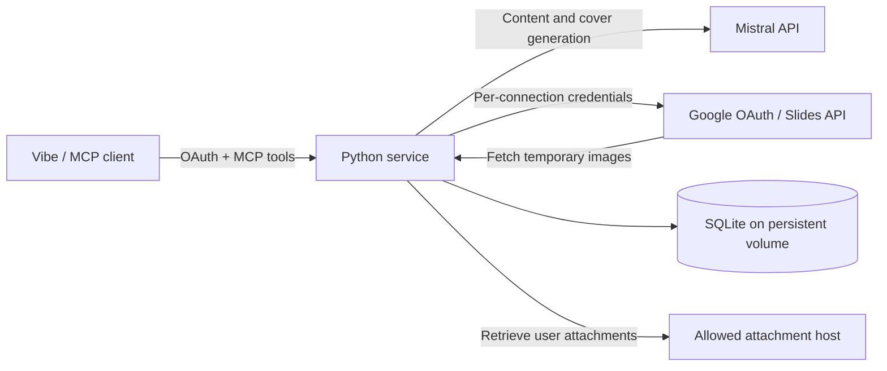

# Architecture

MCP Slides is a single Python service that connects Vibe to Mistral and Google
Slides. Mistral generates content; application code validates it and renders fixed
layouts. Google Slides stores the presentations in each user's own Drive.

## Components

[server.py](../src/mcp_slides/server.py) exposes nine tools for creating, reading,
revising, extending and styling decks, placing images, and managing style defaults.
It resolves the authenticated connection and validates tool inputs before calling
application functions. Blocking provider calls run in a thread pool.

| Modules | Responsibility |
| --- | --- |
| [presentation_service.py](../src/mcp_slides/presentation_service.py) | Coordinate creation and cleanup; return actionable errors. |
| [outline.py](../src/mcp_slides/outline.py), [backgrounds.py](../src/mcp_slides/backgrounds.py) | Generate structured content and cover images through Mistral. |
| [layouts.py](../src/mcp_slides/layouts.py), [slides.py](../src/mcp_slides/slides.py), [gradients.py](../src/mcp_slides/gradients.py) | Define geometry, build Google requests, and prepare gradient assets. |
| [editing.py](../src/mcp_slides/editing.py), [insertion.py](../src/mcp_slides/insertion.py), [styling.py](../src/mcp_slides/styling.py) | Read current decks and apply supported changes. |
| [attachments.py](../src/mcp_slides/attachments.py), [slide_images.py](../src/mcp_slides/slide_images.py) | Retrieve and normalize attachments, validate placement, and insert or replace images. |
| [oauth.py](../src/mcp_slides/oauth.py), [auth.py](../src/mcp_slides/auth.py) | Manage the two OAuth relationships, identity checks, and connection storage. |
| [preferences.py](../src/mcp_slides/preferences.py), [usage.py](../src/mcp_slides/usage.py) | Store connection defaults and enforce shared paid-call limits. |

## Creating a presentation

For “Create a 3-slide presentation about Paris”:

1. Resolve the connection's Google credentials and saved style.
2. Ask Mistral for a title and two content slides. Validate layout types, text
   lengths, and item counts; invalid output gets one additional attempt.
3. Generate the required cover image and publish it at a temporary URL.
4. Build the rendering requests before creating the Google presentation. Create
   the deck, then populate it in one batch that also removes any starter slides.
5. Return the exact Google Slides URL and applied style. Clean up temporary images.

The result is one cover and two content slides. Text remains editable in Google
Slides. Fixed layouts support key messages, bullets, comparisons, and steps;
the model supplies content, while application code controls geometry and formatting.

## Updating an existing presentation

Operations read the current deck and compare its revision with the expected
revision. They inspect supported elements before building a change, then include
Google's `requiredRevisionId` in the write. A concurrent edit causes rejection
instead of overwriting the intervening change.

Wording edits and slide insertion use Mistral to propose validated content.
Styling and attachment placement use deterministic code without a model call.
Text edits preserve supported structure; styling reports slides it cannot safely
change. Insertion adds one content slide and preserves existing slides.

Attachment placement validates a key-message or bullet slide, retrieves a fresh
image from the allowed host, and checks text capacity beside it. Text geometry and
the image are updated together. The full image fits in one frame without cropping;
replacing an occupied frame requires an explicit replacement request. See
[image placement](image-editing-ux.md) for its limits.

## Identity and storage

There are two OAuth relationships: Vibe authenticates to the connector, and the
connector obtains Google authorization. Vibe receives connector tokens; Google
credentials stay on the server. Both flows use PKCE. Google identity claims must
satisfy the configured Workspace-domain or verified-email allowlist.

Each connection has a random subject used to scope credentials and preferences.
Reconnecting creates a new scope, even for the same Google account. Admission is
checked again when tokens or credentials are used; startup purges excluded accounts.

SQLite stores Google credentials, verified identity claims, connector OAuth
records, style preferences, the shared usage counter, and temporary images.
Connector access and refresh tokens are stored by hash. Google credentials are
not separately encrypted in the database. The service therefore requires a
protected persistent volume and runs as one process/replica.

Source text is sent to Mistral but is not stored as a generation brief. User
attachments are not sent to Mistral. Covers, gradients, and normalized attachments
are served through expiring, unguessable URLs so Google can fetch them; this
requires a public server origin. Google retains inserted images after temporary
assets are removed. Revocation removes local connection data without deleting
presentations or revoking Google consent upstream. See [authentication](auth.md)
for the complete token lifecycle and storage details.

## Failure handling and tradeoffs

- **Validate before writing.** Invalid content or cover preparation stops creation
  before a Google deck exists. Fixed layouts and conservative text budgets make
  changes predictable, but do not support arbitrary templates or guarantee visual fit.
- **Do not replay uncertain writes.** Google reads may retry; mutations do not.
  If creation or an update cannot be confirmed, return recovery guidance and a
  deck URL or object identity when available. The caller must inspect before retrying.
- **Preserve partial results.** Deck creation and population are separate Google
  calls. A failure between them can leave an empty or completed deck; the service
  does not automatically delete it. There is no cross-request idempotency key.
- **Bound paid calls.** All connections share a persistent lifetime allowance,
  a process-local concurrency limit, and an operator pause switch. Failed paid
  attempts count. These limits do not measure currency spending.
- **Keep deployment small.** There is no job queue, shared multi-instance storage,
  or total job deadline. Provider timeouts bound individual calls, and a client
  disconnect does not prove that upstream work stopped.

Automated tests mock providers and exercise tool contracts, OAuth isolation,
validation, revision conflicts, and failure recovery. Real provider configuration
and visual output require live checks; release tracking belongs in the
[submission checklist](submission-checklist.md).
