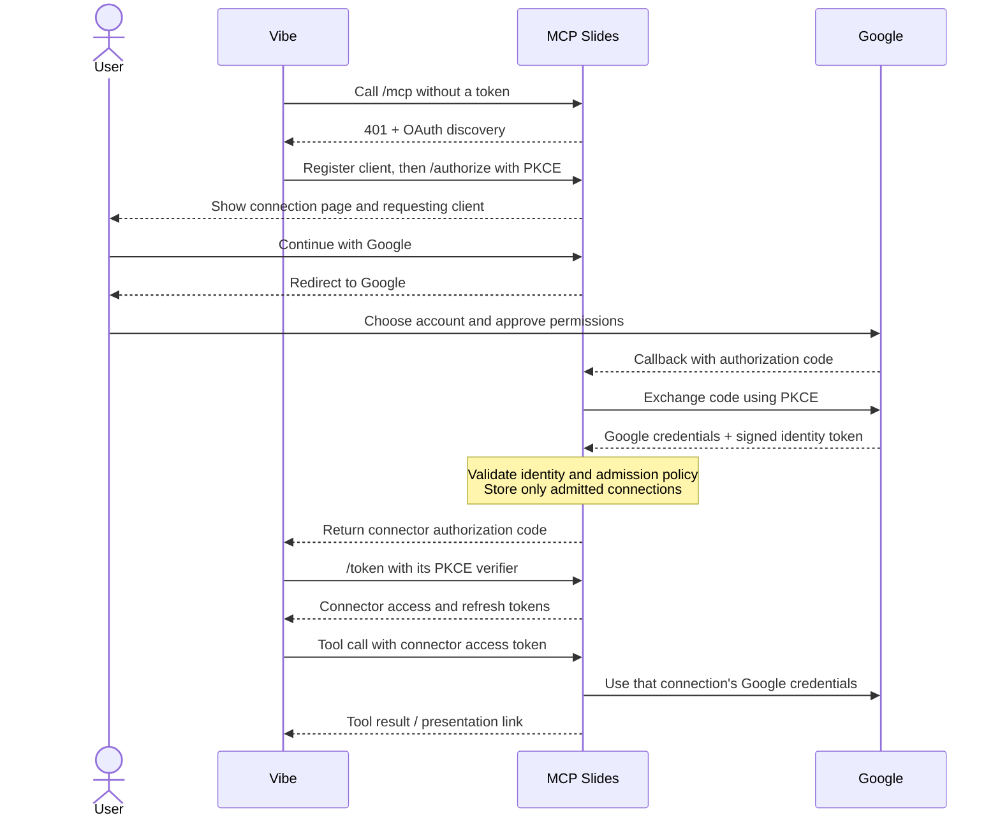

# Authentication — frozen pilot baseline

**Frozen on 9 September 2026**, following approval of the connection experience.
This is the reference for the implemented flow at `d53361d`. Keep this behavior
stable; limit further auth work to bug fixes, configuration, and release checks.
Google publishing and Railway settings are operational state, not implied by this
freeze. Configuration is described below; remaining release checks live in the
[submission checklist](submission-checklist.md#4-verify-google-oauth-and-onboarding).

## One connection, two OAuth relationships

**Vibe authenticates to MCP Slides. MCP Slides obtains Google permission for that
connection.** Google credentials stay on the server; Vibe receives separate
connector tokens. Decks belong to the selected Google account. Model calls use
the operator's Mistral key.



The connection page is ours: it identifies the requesting client, explains
permissions, and exposes the return address under “Connection details.” Google
controls the subsequent account picker and consent screen. The public homepage
(`/`) and privacy policy (`/privacy`) require no login; `/mcp` does.

## Who is admitted?

After verifying Google's ID-token signature, issuer, audience, expiry, subject,
and authorization nonce, admit an account if **either** condition holds:

| Route | Required evidence |
| --- | --- |
| Company account | Google's verified `hd` claim exactly matches `GOOGLE_ALLOWED_DOMAIN`. |
| Personal exception | Google confirms `email_verified=true`, and the email matches an entry in `GOOGLE_ALLOWED_EMAILS` (case-insensitive). |

An email ending in the company domain is insufficient on its own. Missing
allowlists deny everyone. Denial happens before credentials are saved or a
connector grant is issued, and triggers no model call.

```dotenv
GOOGLE_ALLOWED_DOMAIN=mistral.ai
GOOGLE_ALLOWED_EMAILS=aurelien.morel.arthur@gmail.com,vmaxmc2@gmail.com
```

These are the intended pilot settings; set them in Railway. `.env.example` is
only a template. **Remove the friend's email before submission and restart** to
purge its existing connections. Keep the owner's exception.

## Permissions and identity

| Scope | Purpose |
| --- | --- |
| Google `drive.file` | Create files and work with files explicitly made available to the app. |
| Google `openid` + `https://www.googleapis.com/auth/userinfo.email` | Verify identity and enforce admission. |
| Connector `slides.generate` | Authorize the connector's nine tools, including reading and editing. |

Each authorization creates a random **connection subject**. Google's stable
`sub` is stored alongside it, but does not merge connections or preferences.
Reconnecting creates a fresh connection and fresh preferences. There is no
shared Google account or caller-supplied identity fallback.

## Session protection and lifetime

| Item | Behavior |
| --- | --- |
| Connection attempt | Expires after 10 minutes; single-use state, browser cookie binding, form CSRF check, and nonce verification. |
| OAuth code exchange | S256 PKCE on both legs; exact registered client redirect validation. |
| Connector authorization code | Expires after 60 seconds; single use. |
| Connector access token | Expires after one hour; bound to this server's `/mcp` resource. |
| Connector refresh token | Expires after 30 days; rotation starts a new 30-day window and invalidates prior access tokens. Detected replay of a retained used-refresh record revokes that connection. |
| Google access token | Refreshed when needed using that connection's Google refresh credentials. Permanent refresh rejection revokes the local connection; temporary failure returns a retry message. |

Current admission settings are checked during connector access-token validation,
Google credential loading, and connector token issuance/renewal. Checks use the
identity claims verified at connection time; there is no continuous Workspace
membership lookup. Restart after changing Railway variables.

## Storage and disconnection

Persistent SQLite lives at `TOKEN_DB_PATH` (Railway: `/data/tokens.sqlite3`).
It holds Google credentials, minimal identity claims, connector OAuth records,
connection-specific preferences, temporary images, and the shared usage counter.
Connector codes and access/refresh tokens are stored by hash. Google credentials
and OAuth client secrets are **not separately encrypted in the database**.
Keep one worker/replica and preserve the volume across deployments.

Temporary images include generated covers, gradients and normalized attachments.
They are served through unguessable URLs that expire after ten minutes, with
cleanup after use and expired-row removal on subsequent database access. Google
Slides retains images already inserted; deleting temporary assets or revoking the
connection does not remove them from presentations. Attachment placement uses the
existing scopes and does not send the image to the Mistral API.

`/revoke` removes the connection's credentials, identity, connector tokens,
preferences, and temporary images. Startup also purges excluded accounts and
legacy connections lacking verified identity. This does not delete Drive decks
or revoke Google's upstream consent; users can separately remove that consent
in their Google Account. Operational logs avoid credentials and content.

## Deployment configuration

Use the existing Railway service, persistent volume, and Google web OAuth client.
Set the allowlists above and the remaining variables in [.env.example](../.env.example)
in Railway; pushing the template does not apply them. Keep
`PUBLIC_BASE_URL=https://mistral-slides-mcp-production.up.railway.app`.

In the Google project, enable the Google Slides API and configure:

| Google Auth Platform setting | Value |
| --- | --- |
| Data Access | `https://www.googleapis.com/auth/drive.file`, `openid`, `https://www.googleapis.com/auth/userinfo.email` |
| Clients → authorized redirect URI | `https://mistral-slides-mcp-production.up.railway.app/auth/google/callback` |
| Branding → homepage | `https://mistral-slides-mcp-production.up.railway.app/` |
| Branding → privacy policy | `https://mistral-slides-mcp-production.up.railway.app/privacy` |
| Audience | External; In production for onboarding without individual Google tester entries. |

If the origin changes, update all three URLs and the server base URL together.
Google's Authorized domains field is for website ownership, not user admission.
Review Branding/Verification Center requirements, including domain ownership and
support details; publication and brand verification are separate. Deploy the
server admission policy before removing Google's tester gate.

Testing still requires individual Google test users and has seven-day grant
expiry. Older grants may need reconnection after publication. Client Workspace
restrictions may apply in either mode. See Google's [audience documentation](https://support.google.com/cloud/answer/15549945?hl=en)
and [branding requirements](https://developers.google.com/identity/protocols/oauth2/production-readiness/brand-verification).

## Operation and diagnosis

| Symptom | First check |
| --- | --- |
| “Client-only pilot” denial | Railway allowlists, exact selected Google account, then redeploy after correcting variables. |
| Google blocks account before our callback | Google Audience/tester settings and client Workspace restrictions; see Deployment configuration above. |
| Expired connection link | Start a fresh connection from Vibe; do not reuse an old callback URL. |
| Existing connection stops working | Reconnect after token expiry, revocation, or the identity-policy upgrade. |

Usage controls are separate from authentication: defaults are 100 lifetime paid
provider-call attempts and two concurrent calls. `PILOT_PAID_CALLS_ENABLED=false`
pauses new paid operations after redeployment. These are operation limits, not
a currency cap. See [usage settings](../README.md#pilot-usage-controls).

## Code and validation

| File | Responsibility |
| --- | --- |
| [oauth.py](../src/mcp_slides/oauth.py) | Consent, authorization exchange, connector tokens, refresh, revocation. |
| [auth.py](../src/mcp_slides/auth.py) | Google flow, verified identity, admission, credentials, persistence and purge. |
| [server.py](../src/mcp_slides/server.py) | MCP auth configuration, routes and authenticated tool entry points. |
| [pages.py](../src/mcp_slides/pages.py) | Connection UI, public homepage and privacy policy. |
| [usage.py](../src/mcp_slides/usage.py) | Shared paid-operation allowance and concurrency control. |

Recorded validation: 77 full-suite tests passed after implementation; the 10
OAuth tests passed again after the UI update. Tests cover signed identity
validation, admission, PKCE, CSRF, refresh/replay, revocation, isolation, and usage
limits with providers mocked. The user approved the connection UI. This document
does not claim a fresh production audit or acceptance by every client account.

Per-user quotas, account-wide preference merging, storage-encryption changes,
and additional login providers remain outside this auth freeze.
